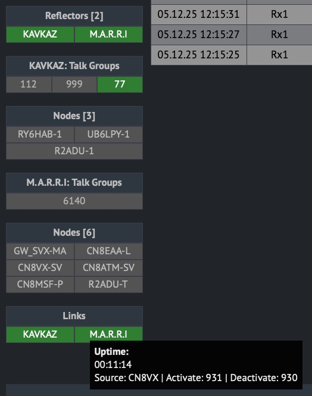
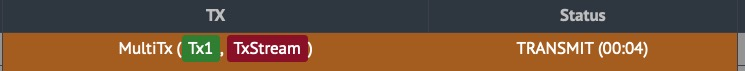

❌  Please do not download this fork until it is announced to be ready!
    
    To satisfy interest, an intermediate version (partially working) is available in this branch

# Svxlink Dashboard

A completely rewritten SVXLink dashboard implementation with modern microservices architecture, preserving the audio monitoring system from the original project.

## Inspiration

This project was inspired by the functionality of:
- [SVXLink-Dashboard-V2 by F5VMR](https://github.com/f5vmr/SVXLink-Dash-V2)

and design from:
- [WPSD Project](https://w0chp.radio/wpsd/)

## License and Attribution

### Design Components
This project incorporates design elements derived from the **WPSD Project**, 
distributed under the **GNU Free Documentation License v1.3**.

**Original Copyright:** © 2023 WPSD Project Development Team, et al.  
**License:** GNU FDL v1.3  
**Special Terms:** No Invariant Sections, No Front-Cover Texts, No Back-Cover Texts

### Audio System Components
The real-time audio monitoring system (WebSocket server and client) is preserved from the original SVXLink-Dashboard-V2 project.

### Code Components
- Audio monitoring system: Preserved from original SVXLink-Dashboard-V2
- Backend architecture: Completely rewritten
- UI/UX: Redesigned from scratch

### Compliance with GFDL v1.3
- All original copyright notices preserved
- This derivative work licensed under same terms
- Full license text included in LICENSE file
- Original English license version prevails for interpretation

## Features

### Modern Architecture
- New server-side architecture, completely rewritten
- Microservices approach
- Improved performance and scalability

### Redesigned Interface
- WSPD-style user interface
- Responsive design
- Modern UI/UX principles

### Enhanced Monitoring
- Informative status panel with connection information
- Reflectors, Talkgroups, Links management
- Composite device error analysis




### Preserved Audio Monitoring System
- **WebSocket audio system** from original project
- **Live RX audio monitoring** directly in browser
- **Auto-reconnection** on connection loss
- **Web Audio API support**
- **Proven solution** from original implementation

## Audio System Implementation (Preserved from Original)

### System Components (Inherited)

The audio monitoring system was preserved from the original SVXLink-Dashboard-V2:

#### Core Components:

1. **Node.js WebSocket Server** (`server.js`)
   - Source: From original project
   - Port: 8001
   - Audio capture via ALSA Loopback
   - PCM audio streaming

2. **JavaScript Audio Client** (`pcm-player.min.js`)
   - Web Audio API for playback
   - Multiple sample rate support (48kHz/32kHz)
   - Auto-reconnection capability

3. **ALSA Loopback Integration**
   - Virtual sound device for audio capture
   - SVXLink integration

4. **Systemd Service** (`svxlink-node.service`)
   - Automatic startup and monitoring

#### Data Flow Architecture (Preserved):

SVXLink → ALSA Loopback → Node.js WS Server → Browser → Web Audio API


## Technical Notes

This is a clean-room implementation inspired by the original SVXLink-Dashboard-V2 but written independently. **The audio monitoring system was preserved from the original project** as a proven and working solution.

## Project Relationship Notice

### This is NOT a Replacement
**This project is an independent fork with significant architectural differences** that make it incompatible with the original SVXLink-Dashboard-V2.

### Key Differences:
- ✅ **Complete backend rewrite** - Different technology stack
- ✅ **Redesigned UI** - WSPD-style interface
- ✅ **Independent development path** - Not intended to merge back with original
- ❌ **Not compatible** with original configurations or data
- ❌ **Not a drop-in replacement** for the original dashboard
- ❌ **Separate issue tracking** - Issues should be reported here, not in original repo

### Audio System (Preserved from Original)

| Component | Status | Source |
|-----------|--------|--------|
| WebSocket Server (`server.js`) | ✅ Preserved | Original project |
| Audio Client (`pcm-player.min.js`) | ✅ Preserved | Original project |
| ALSA Configuration | ✅ Preserved | Original project |
| Systemd Service | ✅ Preserved | Original project |

### What Was Preserved from Original:
1. **Complete audio system** - WebSocket server and client
2. **ALSA Loopback configuration** - Audio capture method
3. **Systemd service** - Startup management
4. **Binary PCM protocol** - Audio transmission format

### What Was Rewritten/Changed:
1. **Entire backend architecture** - Complete overhaul
2. **User interface** - New design
3. **Management system** - New approaches
4. **Component integration** - Different implementation

## Installation & Audio Setup

The audio system uses the same configuration as the original:

### Prerequisites:
```bash
# Install Node.js (if not installed)
sudo apt install nodejs npm

# Install ws module
sudo npm install -g ws

# Configure ALSA Loopback
sudo nano /etc/modules
# Add: snd_aloop
sudo systemctl enable svxlink-node.service
sudo systemctl start svxlink-node.service
sudo systemctl status svxlink-node.service
```

### Using the Audio System:

Open the dashboard in your browser
Look for the "Monitor" button (speaker icon)
Click to activate audio streaming
Button turns green when successfully connected

## Acknowledgments

### Audio System preserved from the original project:

WebSocket Server (server.js) - Original implementation
Audio Client (pcm-player.min.js) - Original implementation
ALSA Configuration - Method from original project
Thanks to the authors of the original SVXLink-Dashboard-V2 for creating an effective audio monitoring system.

## For Original Version Users

If you need updates or features for the original SVXLink-Dashboard-V2, please refer to the [original repository](https://github.com/f5vmr/SVXLink-Dash-V2/tree/main).

If you're looking for: 

__Updates for original SVXLink-Dashboard-V2__ → Go to original repository

__Compatible improvements__ → This project is not for you

__Completely rewritten alternative__ → Continue reading

__Note:__ This fork represents a completely different architectural approach while preserving the proven audio monitoring system from the original project.