# Svxlink Dashboard

A functional pre-release version.

## Inspiration

This project was inspired by the functionality of:

- [SVXLink-Dashboard-V2 by F5VMR](https://github.com/f5vmr/SVXLink-Dash-V2)

and the design of

- [WPSD Project](https://w0chp.radio/wpsd/)

## License

The project incorporates design elements derived from the WPSD Project (styles and element layout),
distributed under the GNU FDL v1.3 license.

Original copyright: Copyright © 2023 WPSD Project Development Team, et al.

## Description

A fully rewritten implementation of an SVXLink control panel with a modern architecture.

Detailed technical information is available in **PROJECT_DETAILS.md**

## Features

This is a tested and functional version, though it is still under active development (minor issues are being fixed, approaches and algorithms optimized, and features added). Please be patient.

I have made every effort to ensure you don't encounter difficulties; however, there's always a chance that the instructions may contain inaccuracies or outdated information.

### New Approach

The panel is designed for SVXLink owners/administrators, reflecting the server's real-time[^note1] status and allowing control over its state[^note2].

### Modern Interface

- Interface in the WPSD style

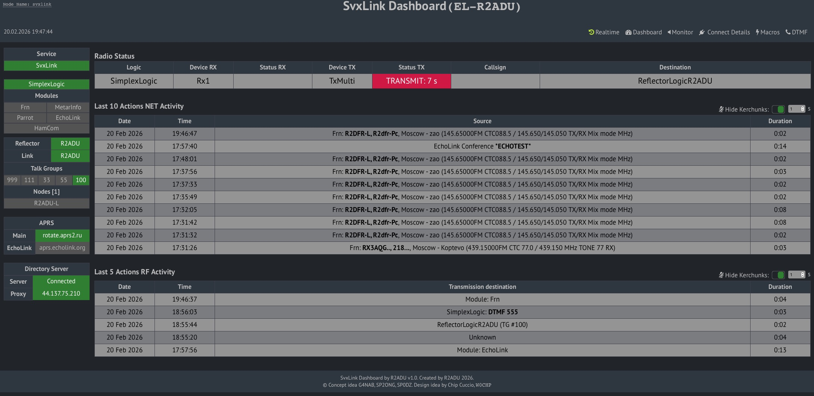

- Disablable  [^note3] multilingual interface with the ability to add custom languages

### Dual-mode updates

- Available realtime and periodic update mode

### Service, Logic, Reflectorsm, Modules and Link states

#### Service
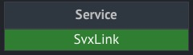

#### Logic and module state

- Active but not connected

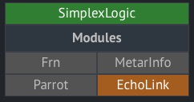

- Active and connected

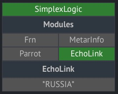

#### Mouse swhitchable modules and links

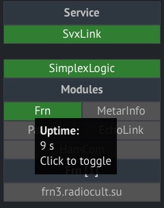

#### Reflector's state and information 

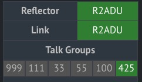

#### Extended pop-up link's information

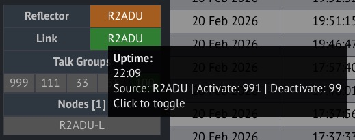

#### Different colours for selected ans temporally monitored talkgroup

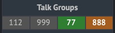

### Additional information

#### APRS connection status

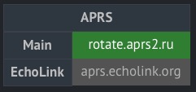

#### Echolink directory and proxy status

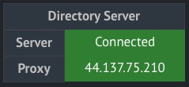

#### Hideable macros panel

Different button colors for different modules

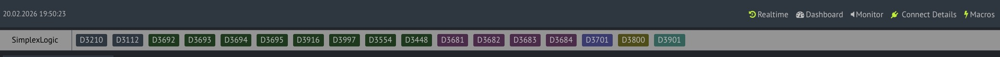

### Receiver and Transmitter status

#### Main receiver & transmitter row

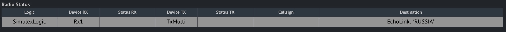
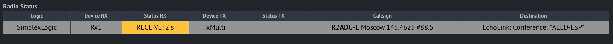
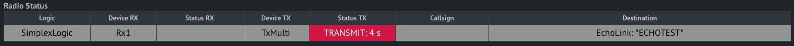

#### Additional reflector's rows

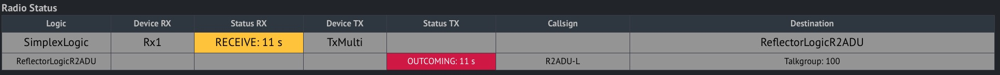

#### Error detecting

Overload and timeout error indication for devices (including composite devices)

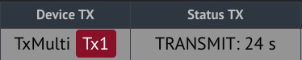

### Convenient DTMF keypad controllable by mouse or direct keyboard input for managing the server state, similar to sending control signals over the air

#### Single logic compact view

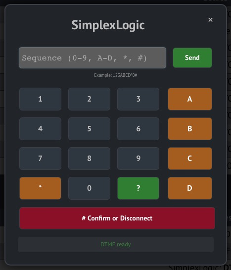

#### Multiple logic supporting

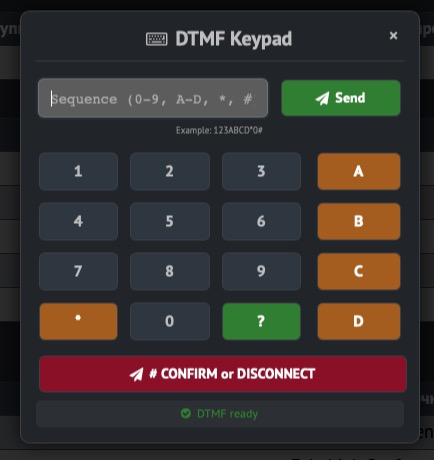

### Audio monitoring of the transmitted signal

Listen activity with web-browser

### Hideable information about current state

#### EchoLink chat, message and malformed support

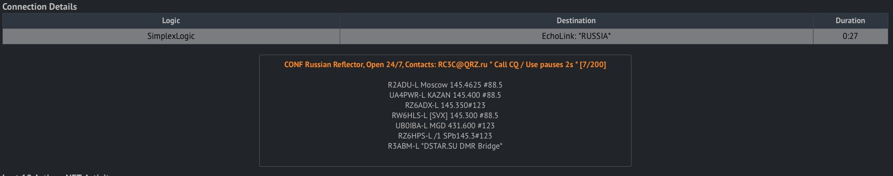

#### Frn server connected nodes

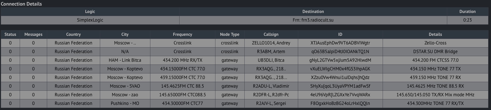

### Historical data with ajustable kerchungs limits

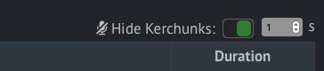

#### Ajustable [^note3] network activity

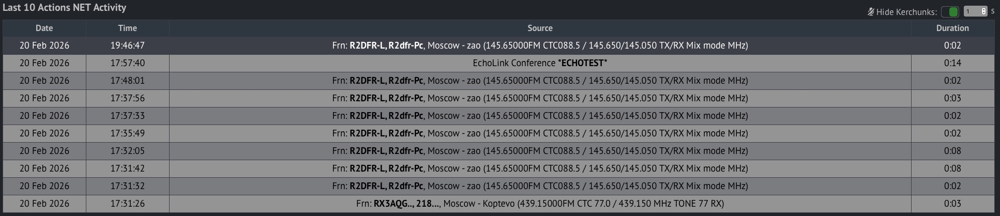

#### Ajustable [^note3] local activity (RF incoming)

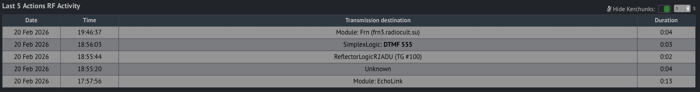

## Technical Notes

This is an independent implementation, primarily related to the original project by similar principles.

## Important Compatibility Note

**This project is NOT a replacement or update for the original SVXLink-Dashboard-V2**

### What was preserved from the original:

**The audio monitoring system** was preserved from the [source - f5vmr/SVXLink-Dash-V2](https://github.com/f5vmr/SVXLink-Dash-V2) as a proven and functional solution.

## For Users of the Original Project

If you are looking for:
- **Updates for the original SVXLink-Dashboard-V2** → please refer to the [original repository](https://github.com/f5vmr/SVXLink-Dash-V2)
- **Compatible enhancements** → this project is not for you
- **A fully reworked alternative** → please continue reading

## Installation

Deployment instructions are available in `doc/INSTALL.md`

[^note1]: Radio status, active module, reflector, connected nodes.
[^note2]: The `DTMF_CTRL_PTY` parameter must be configured for control.
[^note3]: Configured via parameter in `settings.php` file.
