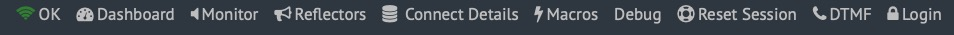
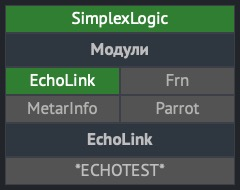
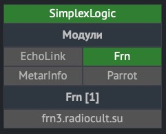
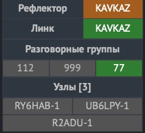
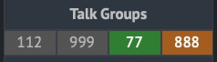
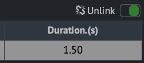
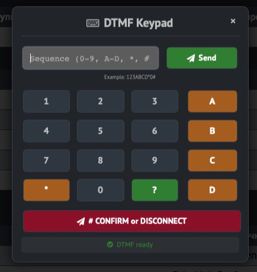
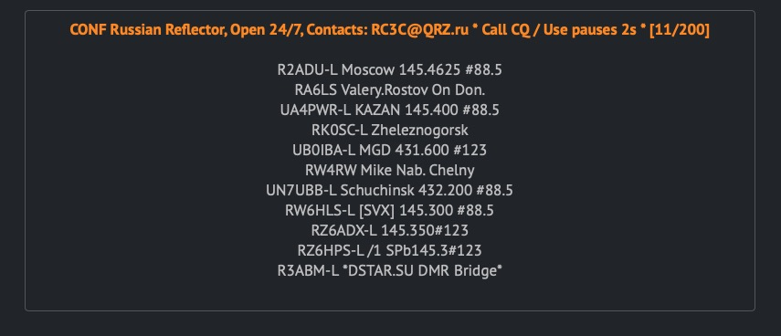
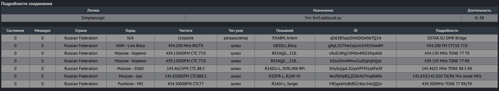

# Svxlink Dashboard

Работоспособная бета-версия. 

## Вдохновение

Этот проект был вдохновлен функциональностью:

- [SVXLink-Dashboard-V2 от F5VMR](https://github.com/f5vmr/SVXLink-Dash-V2)

и дизайном

- [WPSD Project](https://w0chp.radio/wpsd/)

## Лицензия

Проект содержит элементы дизайна, производные от WPSD Project (стили и компоновку элементов),
распространяемые под лицензией GNU FDL v1.3.

Original copyright: Copyright © 2023 WPSD Project Development Team, et al.

## Описание

Полностью переписанная реализация панели управления SVXLink с современной архитектурой.

Подробная техническая информация находится в **PROJECT_DETAILS.md**

## Особенности

Это проверенная мной и работоспособная версия, которая тем не менее находится в стадии доработки (исправляются мелкие недочеты, оптимизируются подходы и алгоритмы, дописываются фичи). Пожалуйста будьте снисходительны.

Я принял максимум усилия чтобы у вас не возникло трудностей, однако всегда остается вероятность того что в инструкциях есть неточности или устаревшая информация.

### Новый подход 

Панель ориентирована на владельцев/администраторов svxlink, отражает в реальном времени[^note1] состояние сервера и позволяет управлять его состоянием[^note2].

### Современный интерфейс

- Пользовательский мультиязычный интерфейс в стиле WSPD

### Расширенный мониторинг

- Информативная панель состояния с информацией о соединениях

- Доступные и активный модуль, подключенные узлы/конференции/серверы итд (для модулей EchoLink/Frn) 

- Рефлекторы, разговорные группы, линки, подключенные узлы

- Удобная DTMF клавиатура  управляемая мышью или прямым вводом с клавиатуры для управления состоянием сервера аналогично передаче управляющих сигналов из эфира

- Аудио мониторинг передаваемого в эфир сигнала 

- Расширенная информация от активного модуля

- Исторические данные (последние n-событий в эфире, вызовы пришедшие из сети)

## Технические примечания

Это независимая реализация, связанная с оригинальным проектом в основном схожими принципами. 

## Важное примечание о совместимости

**Данный проект НЕ является заменой или обновлением оригинального SVXLink-Dashboard-V2**

### Что было сохранено из оригинала:

**Система аудио мониторинга** была сохранена из [источника - f5vmr/SVXLink-Dash-V2](https://github.com/f5vmr/SVXLink-Dash-V2)  как проверенное и работоспособное решение.

## Для пользователей оригинального проекта

Если вы ищете:
- **Обновления для оригинального SVXLink-Dashboard-V2** → обратитесь к [оригинальному репозиторию](https://github.com/f5vmr/SVXLink-Dash-V2)
- **Совместимые улучшения** → этот проект не для вас
- **Полностью переработанную альтернативу** → продолжайте чтение

## Установка

Инструкция по развертыванию находится в `doc/INSTALL.RU.md`

[^note1]: Состояние радио, активный модуль, рефлектор, подключенные узлы.
[^note2]: Для управления необходимо настроить параметр `DTMF_CTRL_PTY`.