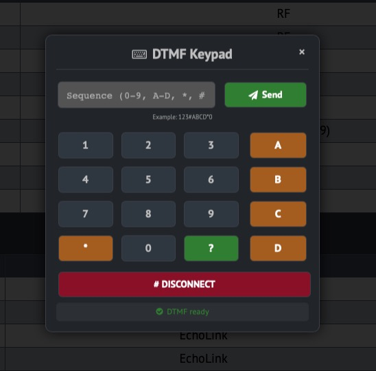

❌  Не пытайтесь использовать этот проект пока видите это сообщение!
    
    Для удовлетворения интереса доступна промежуточная бета-версия в этой ветке

# Svxlink Dashboard

## Вдохновение

Этот проект был вдохновлен функциональностью:

- [SVXLink-Dashboard-V2 от F5VMR](https://github.com/f5vmr/SVXLink-Dash-V2)

и дизайном

- [WPSD Project](https://w0chp.radio/wpsd/)

## Лицензия

Этот проект содержит элементы дизайна, производные от WPSD Project,
распространяемые под лицензией GNU FDL v1.3.

Original copyright: Copyright © 2023 WPSD Project Development Team, et al.

## Описание

Полностью переписанная реализация панели управления SVXLink с современной архитектурой.
Подробная информация находится в **PROJECT_DETAILS.md**

## Особенности

### Новый подход 

- Функциональная наполненность в соответствии с моими требованиями

### Современный интерфейс

- Пользовательский интерфейс в стиле WSPD (функциональный состав уточняется)

- Адаптивный дизайн

### Расширенный мониторинг

- Информативная панель состояния с информацией о соединениях

- Рефлекторы, разговорные группы, линки

- Управление состоянием линка к рефлектору

- Удобная DTMF клавиатура для управления состоянием управляемая мышью или прямым вводом с клавиатуры

- Анализ ошибок для составных аудиоустройств (не реализовано в текущей весии, будет поздней)

## Техническая реализация аудио системы (унаследовано из оригинала)

Система аудио мониторинга была заимствована из оригинального SVXLink-Dashboard-V2:

## Технические примечания

Это независимая реализация, вдохновленная оригинальным SVXLink-Dashboard-V2, 
но написанная с нуля под собственные нужды. **Система аудио мониторинга была сохранена из оригинального проекта** как проверенное и работоспособное решение.

## ⚠️ Важное примечание о совместимости

**Данный проект НЕ является заменой или обновлением оригинального SVXLink-Dashboard-V2**

Это независимое ответвление (fork) со значительными architectural changes, которые:
- ❌ **Не совместимы** с оригинальной кодовая базой
- ❌ **Не могут** быть использованы как drop-in replacement
- ❌ **Не принимают** Pull Request'ы для оригинального проекта

## Сравнение с оригиналом

| Характеристика | Оригинальный проект | Данный форк |
|----------------|-------------------|-------------|
| **Аудио система** | **✅ WebSocket (Node.js)** | **✅ Сохранена из оригинала** |
| Стиль интерфейса | Pi-star like | WSPD-style |
| Аудио мониторинг | ✅ WebSocket | ✅ **То же решение** |
| Совместимость | - | ❌ Не совместим |

### Что было сохранено из оригинала:

1. **Аудио система полностью** - WebSocket сервер и клиент
2. **ALSA Loopback конфигурация** - метод захвата аудио
3. **Systemd сервис** - управление запуском
4. **Бинарный PCM протокол** - формат передачи аудио

### Что было изменено/переписано:

1. **Вся архитектура backend** - полная переработка
2. **Пользовательский интерфейс** - новый дизайн
3. **Система управления** - новые подходы
4. **Интеграция компонентов** - по-новому

## Для пользователей оригинального проекта

Если вы ищете:
- **Обновления для оригинального SVXLink-Dashboard-V2** → обратитесь к [оригинальному репозиторию](https://github.com/f5vmr/SVXLink-Dash-V2)
- **Совместимые улучшения** → этот проект не для вас
- **Полностью переработанную альтернативу** → продолжайте чтение

## Установка

Инструкция по развертыванию тестовой версии в `doc/INSTALL.RU.md`

### Благодарности

Аудио система была заимствована из оригинального проекта:

WebSocket сервер (server.js) - оригинальная реализация
Аудио клиент (pcm-player.min.js) - оригинальная реализация
Конфигурация ALSA - метод из оригинального проекта
Авторам оригинального SVXLink-Dashboard-V2 за создание эффективной системы аудио мониторинга.

## ВАЖНО: Данная версия НЕ совместима с оригинальным SVXLink-Dashboard-V2

Это независимый форк  https://github.com/f5vmr/SVXLink-Dash-V2/tree/main

Полной переработкой backend архитектуры
Новым интерфейсом в стиле WSPD
Критическими изменениями в архитектуре
Сохранением проверенной аудио системы из оригинала
